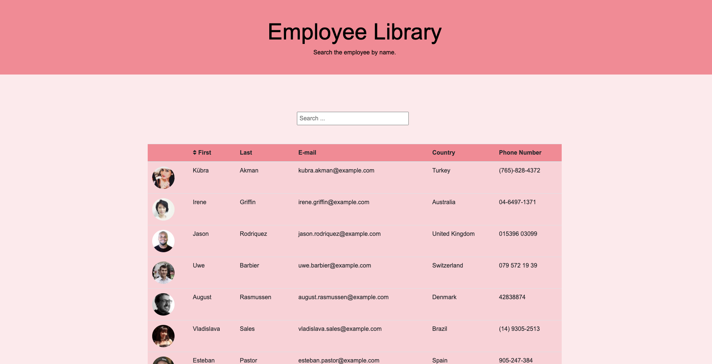

<h1 align= "center">Employee Library</h1> 
<h2>Live Link</h2>
<h3><a target="_blank" href= "https://chaalexander.github.io/employeelibrary/" >Live Link</a></h3>  
<h2> Table of Contents </h2>
<li><a href="#description">Description</a></li>  
<li><a href="#tech">Technology Stack</a></li> 
<li><a href="#usage">Usage</a></li> 
<li><a href="#screen">ScreenShots</a></li> 
<li><a href="#contributors">Contributors</a></li>   
<li><a href="#contact">Contact</a></li> 
<h2 id="description"> Description </h2>

Application created to search for employees
   
<h2 id="tech"> Technology Stack </h2>          
<ul>
<li>React.js</li>
<li>CSS</li>
<li>Boostrap</li>
</ul>          
<h2 id="usage"> Usage </h2>
Search the employee you are looking for by name. Also sorted ascendent and descendent.
<h2 id="screen"> ScreenShoots </h2>
<h4> Desktop </h4>

<h4> Test </h4>

<h2 id="contributors"> Contributors </h2>

<a  href= "https://github.com/chaalexander" >@chaalexander</a>
 
<h2 id="contact"> Contact </h2>         
<h5> Name: Charlenne Alexander </h5>       
<h5><a target="_blank" href= "https://github.com/chaalexander" >GitHub</a></h5>  
<h5><a target="_blank" href= "https://chaalexander.github.io/" >Portfolio</a></h5>  
<h5><a target="_blank" href= "mailto:charlennep@gmail.com" >charlennep@gmail.com</a></h5>       
<h5><a target="_blank" href= "https://www.linkedin.com/in/cha-alexander" >LinkedIn</a></h5>
